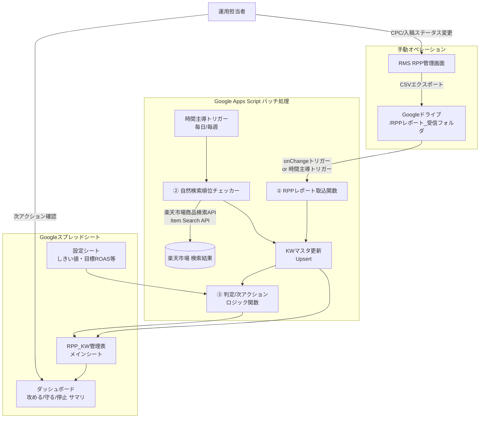

# 楽天RPP キーワード管理システム 設計書(v0.1)

## 1. 背景・目的

現状、RPP(楽天プロモーションプラットフォーム)の運用は下記を手作業で行っている。

- RMS(楽天市場店舗管理システム)のRPP画面から実績を都度確認
- キーワードごとの表示順位・自然検索順位を目視で確認しシートに転記
- 目安CPC・競合状況を見ながら入札の強弱(攻める/守る/停止)を判断

これをGoogleスプレッドシート + Google Apps Script(GAS)で自動化し、

1. RPPレポート(RMSからのCSVエクスポート)をGoogleドライブに置くだけで実績(Imp/Click/CV/売上等)がキーワード単位で反映される
2. 入稿有無に関わらず全キーワードの自然検索順位を定期取得できる
3. 上記データから「攻める/守る/停止/監視」を自動判定し次アクションを提示する

仕組みを構築する。対象商品はプロテインモンスター(Monsterタイプ/Sobaタイプの2種)。

## 2. 対象商品・ターゲット整理(判定ロジックの前提)

| 商品 | 特徴 | 主戦場になりやすいKW群 |
|---|---|---|
| Monster(タンパク質31.7g) | 高タンパク・トレーニング志向 | 「高たんぱく」「筋トレ○○」「プロテイン 麺/パスタ」等、筋トレ男子向け訴求 |
| Soba(タンパク質21g、そば粉30%) | 食べやすさ・置き換え志向 | 「ダイエット そば/蕎麦」「置き換え」「ヘルシー」等、QOL重視の女性向け訴求 |

同じ語幹のKWでも商品によって優先度が変わるため、KW管理表は **「商品」列を主キーの一部** として持つ(既存シートの構成を踏襲)。

## 3. システム全体構成



**構成要素は全てGoogle Workspace内で完結**(Googleスプレッドシート + Google Apps Script + Google Drive + 楽天Web Service API)。追加のサーバーやDBは不要。

## 4. データフロー詳細

### 5-1. RPPレポート取込(実績反映)

1. 運用担当者がRMSからRPPレポート(CSV, 日次/週次)をエクスポートし、指定のDriveフォルダにアップロード
2. GASの `onChange`(Drive監視は直接トリガーできないため、実際は**時間主導トリガー(例:1時間ごと)でフォルダ内の新規/未処理ファイルをポーリング**)がファイルを検知
3. CSVをパースし、キーワード列・商品列をキーに `RPP_KW管理表` へ以下を反映(該当行がなければ新規追加)
   - Click, Imp, CV(720h), CVR, 広告費, 売上(720h), ROAS, CPA, 現在の広告表示順位, 実績集計期間
4. 取込済みファイルは `処理済み` フォルダへ移動(二重取込防止)

> 補足: RPPレポートのCSV列構成はRMSの仕様に依存するため、実装時に実際のCSVサンプルを1本もらい、列マッピング表を確定させる必要あり(要確認事項として後述)。

### 5-2. 自然検索順位チェッカー(入稿有無に関わらず全KW対象)

- **方式**: 楽天が公式提供する「楽天市場商品検索API(Ichiba Item Search API)」をGASから呼び出す
  - 理由: 実際の検索結果画面をスクレイピングする方法は利用規約抵触・DOM変更への脆弱性リスクがあるため避け、公式APIを使う
  - 制約: 公式APIのソート結果は画面表示(パーソナライズ・広告枠込み)と完全一致しない場合がある → **「自然検索順位」は目安値としてトレンド(上昇/下降)の把握用と位置付ける**
- **処理**:
  1. `RPP_KW管理表` の全行(入稿中・非入稿問わず)をループ
  2. 各行の「商品」に対応する自社itemCode(Monster用/Soba用をあらかじめ設定シートに登録)と、KWでAPIを検索(`hits=30`を複数ページ、例:上位150件=5ページまで)
  3. 検索結果内に自社itemCodeが出現する位置を順位として記録。150件以内に出現しなければ「圏外(150+)」
  4. APIレート制限(概ね1req/秒)を考慮し、KW数が多い場合は複数日に分散 or 実行時間内で分割実行(GASは1回6分の実行時間上限があるため、続きから再開できるよう進捗をプロパティに保存)
  5. 取得日・順位を `自然検索順位` 列(履歴を残す場合は日付列を追加、または直近値+前回値の2列運用)に書き込み

### 5-3. 判定/次アクション ロジック

「設定」シートに目標値を切り出し、担当者がコード変更なしで調整できるようにする。

| 設定項目 | 例 |
|---|---|
| 目標ROAS | 300% |
| 目標CPA(上限) | 増し分利益ベースで算出(算出式は10章) |
| 自然検索順位「圏外」しきい値 | 150位(4ページ以降) |
| 表示順位「良好」しきい値 | 5位以内 |
| データ最小サンプル(判定に必要なClick数) | 10件 |

判定マトリクス(例):

| 運用ステータス | 実績 | 自然検索順位 | 判定 | 次アクション |
|---|---|---|---|---|
| 入稿中 | ROAS≧目標 かつ 表示順位良好 | - | 好調・守る | CPC現状維持。定期モニタリングのみ |
| 入稿中 | ROAS≧目標 だが表示順位が悪い | - | 機会損失・攻める | CPC増額を提案(推奨CPC列に算出値) |
| 入稿中 | ROAS<目標 or CPA>目標 | - | 要改善 | CPC減額 or 除外KW化を提案 |
| 入稿中 | データ不足(Click<しきい値) | - | データ蓄積中 | 判定保留、様子見期間を明示 |
| 非入稿 | - | 圏外 or 順位低下傾向 | 攻める候補 | 新規入稿(テストCPC)を提案 |
| 非入稿 | - | 上位(良好) | 守る(現状維持) | 入稿不要、広告費をかけず自然流入を維持 |
| 入稿中 | 効果薄・優先度C | 上位でも下位でも | 停止候補 | 停止して他KWへ予算再配分 |

この表をベースにGAS側で `判定` 列・`次アクション` 列を数式(`ARRAYFORMULA`/`IFS`)またはGAS関数で自動計算する。数式ベースにすることで担当者が中身を追いやすく、GASは「データ取得・書き込み」役に、「判定ロジック」はシート上の数式に寄せるのが保守性の観点で望ましい。

## 5. スプレッドシート構成(シート設計)

既存の「RPP KW管理表」(月・木運用)をベースに拡張する。

1. **`RPP_KW管理表`**(メイン): 商品/KW/KW分類/優先度/競合/運用ステータス/現CPC/目安CPC/**広告表示順位**/**自然検索順位**/**自然検索順位_取得日**/実績状態/Click/CV(720h)/CVR/広告費/売上(720h)/ROAS/CPA/判定/推奨CPC/次アクション/最終実績更新/今回設定CPC
2. **`ダッシュボード`**: 攻める候補Top N、停止候補、要改善KW、自然検索順位が下落したKWなどをフィルタ/ピボットで表示。加えて、**店舗全体の月次KPI(アクセス人数/CVR/客単価/定期登録者・購入者数)の推移を並べたセクション**を設け、RPPのKW単位判断と店舗全体のファネル課題(9章参照)を同じ画面で突き合わせられるようにする
3. **`設定`**: 目標ROAS・目標CPA・しきい値・商品ごとのitemCode(Monster/Soba)・**原価/送料/手数料率などの変動費パラメータ(セットサイズ別)**・楽天API認証情報の格納場所(※直書き厳禁、Script Propertiesを使用)
4. **`取込ログ`**: 取込済みRPPレポートファイル名・取込日時・自然検索順位チェック実行履歴(エラー時のトラブルシュート用)

## 6. 技術要素まとめ

| 要素 | 採用技術 |
|---|---|
| データ保存/UI | Googleスプレッドシート |
| バッチ処理 | Google Apps Script(時間主導トリガー) |
| ファイル連携 | Google Drive API(GAS組み込みの`DriveApp`) |
| 自然検索順位取得 | 楽天市場商品検索API(Rakuten Web Service, 要`applicationId`取得) |
| RPPレポート実績取込 | CSVパース(RMSエクスポート) |
| 秘匿情報管理 | GAS Script Properties(APIキー等をシートに直書きしない) |

## 7. 運用フロー(想定)

1. (週次)RMSからRPPレポートをエクスポートしDriveの受信フォルダへアップロード
2. GASが自動取込し実績を反映(手動操作不要、時間主導トリガーが検知)
3. (週1〜2回)自然検索順位チェッカーが全KWの順位を更新
4. 担当者はダッシュボードで「攻める候補」「停止候補」を確認
5. RMS側で実際のCPC変更・入稿/停止操作を実施(本設計のv0.1ではRPPの入札自動変更はスコープ外、提案止まり)
6. 実施結果は次週のレポート取込で自動反映され、判定が更新される

## 8. 拡張案(v0.2以降)

- RPPの入札(CPC)変更API連携(楽天が対応API提供している場合)による半自動/全自動入札調整
- 自然検索順位の履歴をシート内に時系列蓄積し、順位推移グラフを自動生成
- Slack/Chatwork通知(「圏外に落ちたKW」「停止候補が発生」等をトリガー通知)
- Monster/Sobaだけでなく他商品追加時にKW管理表をテンプレート化して横展開

## 9. 実績データから見る現状分析(2026年2月〜8月・Monster)

共有いただいた月次実績(アクセス人数/転換率/客単価/定期登録・購入者数)を基に、当初の仮説(課題=アクセス・CVR・定期獲得)を数字で検証すると、下記のように解像度を上げられる。

| 月 | アクセス人数 | 転換率(CVR) | 総購入件数 | 客単価 | 定期登録者 | 定期購入者 |
|---|---:|---:|---:|---:|---:|---:|
| 4月 | 3,487 | 4.01% | 140 | 1,438円 | - | - |
| 5月 | 1,817(-47.9%) | 2.20% | 40 | 1,787円 | 1 | 1 |
| 6月 | 1,393(-23.3%) | 7.18% | 100 | 2,884円 | 6 | 6 |
| 7月 | 1,263(-9.3%) | 9.18% | 116 | 2,570円 | 14 | 13 |
| 8月 | 687(-45.6%) | 9.02% | 62 | 2,355円 | 14 | 6 |

**わかること:**

1. **CVRはむしろ好調で、現時点でのボトルネックではない**。4〜5月の低迷(4.01%→2.20%)を脱し、6月以降は7〜9%台で安定・改善傾向にある。EC平均と比べても高水準。「CVR改善」を最優先課題にするより、今の高CVRを維持しながら別のレバーを引く方が投資対効果が高い。
2. **8月の売上急落(29.8万→14.6万円、-51%)は、ほぼ全てアクセス減で説明できる**。7月→8月のCVRはほぼ横ばい(9.18%→9.02%、-0.16pt)なのに対し、アクセスは-45.6%。実際 `1,263×9.18%≒116件`(7月実績と一致)、`687×9.02%≒62件`(8月実績と一致)であり、購入件数の減少はCVR劣化ではなくトラフィック減少がそのまま効いている。**「アクセス」は仮説通り最重要課題**、特に8月の急減の原因特定(RPP配信量減/CPC不足による表示順位低下/自然検索順位低下/季節性など)を優先して調査すべき。
3. **「定期獲得」は仮説とはやや違う形の課題**。定期登録者数は7月14名→8月14名で新規獲得が横ばい(頭打ち)。より深刻なのは、**登録者数が同じなのに定期購入(決済実行)者数が13名→6名まで半減している**点で、これは新規獲得の問題ではなく「既存定期会員の継続実行率(スキップ/解約/決済失敗)」の問題である可能性が高い。定期売上も78,156円→38,952円とほぼ比例して半減している。RPP設計とは別に、定期購入の解約理由・決済エラー率をRMS定期購入管理画面で確認することを推奨。

→ この分析結果を踏まえ、本システムのダッシュボードには **RPP(KW単位)の指標だけでなく、店舗全体のアクセス/CVR/定期購入実行率の月次トレンドを並べて見られるセクション**を追加する(下記5章のダッシュボード仕様に反映)。アクセス減少局面では「攻める」判定の閾値を意図的に緩め、露出獲得を優先する運用ルールも判定ロジックに組み込む余地がある。

## 10. 収益性(増し分利益)ベースの目標CPA算出ロジック

「しきい値は増し分利益につながるライン」という方針に沿って、目標CPA(RPPに使ってよい1受注あたりの広告費上限)を勘に頼らず自動計算する。

### 10-1. 変動費構造

| 商品 | セットサイズ | 原価 | 送料 | 変動費(原価+送料) |
|---|---|---:|---:|---:|
| Monster | 10食 | 700円 | 400円 | 1,100円 |
| Monster | 20食以上 | 1,400円(700円×2) | 500円 | 1,900円 |
| Soba | 10食 | 770円 | 400円 | 1,170円 |
| Soba | 20食以上 | 1,540円(770円×2) | 500円 | 2,040円 |

※20食以上は「10食あたりの原価×セット数/10」で線形按分している想定。30食・40食等の設定がある場合は同様に按分。

加えて、**売上に対する定率費用**として

- 販売手数料: 売上 × 15%
- 支払い手数料: 売上 × 2%

が発生するため、合計17%が売上から差し引かれる。

### 10-2. 増し分利益の計算式

```
増し分利益(受注1件) = 売上 × (1 - 0.15 - 0.02) - 変動費(原価+送料)
                  = 売上 × 0.83 - 変動費
```

この「増し分利益」が、RPPを含む広告費を投下してもなお赤字にならない上限ライン(＝理論上の目標CPA上限)になる。ただし増し分利益を広告費に全額使うと利益がゼロになるため、実務上は**利益確保係数α**を設定し、

```
目標CPA(上限) = 増し分利益 × α   (例: α=0.5 → 増し分利益の半分までを広告費上限とする)
```

とする。αは「設定」シートのパラメータとし、事業側で調整可能にする(利益優先ならα↓、シェア拡大優先ならα↑)。

### 10-3. 定期購入を加味した拡張(将来対応)

初回のみの単発利益で目標CPAを決めると、定期(サブスク)転換が見込めるKW/顧客層への投資が過小評価される。将来的には

```
目標CPA(LTV考慮) = 単発増し分利益 × α + 定期転換率 × 定期1回あたり増し分利益 × 想定継続回数 × α
```

のようにLTV(生涯価値)ベースに拡張できる。ただし現状は9章の分析の通り「定期購入の継続実行率」自体が不安定なため、**v0.1では単発増し分利益ベースのシンプルな計算に留め、定期継続率が安定してからLTV拡張に着手する**のが妥当。

### 10-4. 本ロジックを確定するために必要な入力(未確定)

- 商品ごとの実売価格(10食/20食などセット別の税込販売価格) ※現時点で未共有のため、目標CPAの具体金額(円)はまだ算出できない
- 利益確保係数α の初期値(事業側の意向)
- 20食以外のセットサイズ(30食等)の有無と価格

これらが揃い次第、10-2の式に実売価格を当てはめて商品×セットサイズごとの「目標CPA(円)」を「設定」シートに確定値として登録する。

## 11. 要確認事項(設計を固める上で必要な情報)

- [ ] RMSのRPPレポートCSVの実サンプル(列名・文字コード・区切り文字)
- [ ] 楽天Web Service(Rakuten Developers)の`applicationId`取得状況、および利用規約上API呼び出し頻度の制約確認
- [ ] Monster/Sobaそれぞれの自社itemCode(商品URL/商品コード)
- [ ] 目標ROAS・利益確保係数αなど判定しきい値の初期値
- [ ] RPPレポートの取込頻度(日次 or 週次)と自然検索順位チェックの頻度(頻度が高いほどAPI呼び出し回数増)
- [ ] 入稿しない(非入稿)キーワードも含めた全量KWリストの最新版(既存シートの「ソバ」タブ等、他にも管理対象があるか)
- [ ] 商品ごとの実売価格(セットサイズ別、10章の目標CPA算出に必須)
- [ ] 8月のアクセス急減(-45.6%)の要因心当たり(RPP予算/入札を絞った、自然検索順位が下がった、季節要因等)
- [ ] 定期購入の継続実行率低下(7月13名→8月6名)について、RMS定期購入管理画面での解約・決済エラー理由の確認状況
