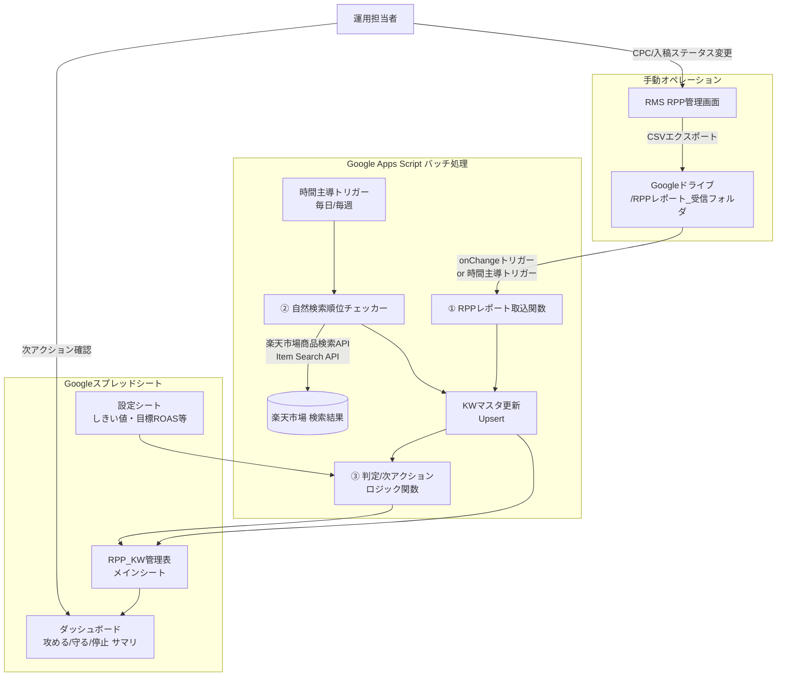

# 楽天RPP キーワード管理システム 設計書(v0.1)

## 1. 背景・目的

現状、RPP(楽天プロモーションプラットフォーム)の運用は下記を手作業で行っている。

- RMS(楽天市場店舗管理システム)のRPP画面から実績を都度確認
- キーワードごとの表示順位・自然検索順位を目視で確認しシートに転記
- 目安CPC・競合状況を見ながら入札の強弱(攻める/守る/停止)を判断

これをGoogleスプレッドシート + Google Apps Script(GAS)で自動化し、

1. RPPレポート(RMSからのCSVエクスポート)をGoogleドライブに置くだけで実績(Imp/Click/CV/売上等)がキーワード単位で反映される
2. 入稿有無に関わらず全キーワードの自然検索順位を定期取得できる
3. 上記データから「攻める/守る/停止/監視」を自動判定し次アクションを提示する

仕組みを構築する。対象商品はプロテインモンスター(Monsterタイプ/Sobaタイプの2種)。

## 2. 対象商品・ターゲット整理(判定ロジックの前提)

| 商品 | 特徴 | 主戦場になりやすいKW群 |
|---|---|---|
| Monster(タンパク質31.7g) | 高タンパク・トレーニング志向 | 「高たんぱく」「筋トレ○○」「プロテイン 麺/パスタ」等、筋トレ男子向け訴求 |
| Soba(タンパク質21g、そば粉30%) | 食べやすさ・置き換え志向 | 「ダイエット そば/蕎麦」「置き換え」「ヘルシー」等、QOL重視の女性向け訴求 |

同じ語幹のKWでも商品によって優先度が変わるため、KW管理表は **「商品」列を主キーの一部** として持つ(既存シートの構成を踏襲)。

### 2-1. 栄養成分の違い(KW訴求の裏付け)

| 成分(1食あたり) | Monster | Soba | 差分の意味 |
|---|---:|---:|---|
| たんぱく質 | 31.7g | 21g | Monsterは「高たんぱく」訴求に強い数値。Sobaは麺類・置き換え食としては十分高いが、Monster比では見劣りする |
| 食物繊維 | 0.9g | 3.2g | **Sobaは食物繊維がMonsterの3.5倍以上**。「腸活」「お通じ」「ダイエット中の食物繊維不足」等、女性向けQOL訴求のKW(食物繊維 麺/そば等)に展開できる独自の強み |
| 炭水化物・糖質 | 12.8g/11.9g | 20.2g/17g | Sobaはそば粉30%配合で炭水化物はやや多いが、そば特有の食べやすさ・満足感につながる |
| エネルギー | 201.3kcal | 177kcal | Sobaの方が低カロリーで「置き換えダイエット」との親和性が高い |
| 原材料 | えんどう豆タンパク粉中心 | そば粉+えんどう豆タンパク粉、味はほぼ蕎麦 | Sobaは「タンパク質強化された蕎麦」という立ち位置。プロテイン感の強いMonsterに対し、**Sobaは"美味しく続けやすい"を軸にしたKW(そば ダイエット、置き換え そば等)が刺さりやすい** |

→ Sobaは「高タンパク」の直接訴求よりも、**「食物繊維」「低カロリー」「美味しい置き換え」を絡めたKW**の優先度を上げるのが、栄養成分の裏付けとして妥当。KW分類(既存シートの「ダイエット・置換」「筋トレ食事」等)にこの観点を反映する。

## 3. システム全体構成



**構成要素は全てGoogle Workspace内で完結**(Googleスプレッドシート + Google Apps Script + Google Drive + 楽天Web Service API)。追加のサーバーやDBは不要。

## 4. データフロー詳細

### 4-1. RPPレポート取込(実績反映)

実際のRMSエクスポートCSV(`rpp_reports_florahouse_*.csv`)を確認できたため、フォーマットを以下で確定する。

**ファイル形式の注意点(実装上必須):**
- **文字コードはShift-JIS(CP932)**。GASで`DriveApp`からBlobを取得したら`blob.getDataAsString("Shift_JIS")`で明示的にデコードする(既定のUTF-8のまま読むと文字化けする)
- ファイル冒頭7行はメタ情報のプリアンブル(実行日時・検索条件・「■■■■■ 商品・キーワードCPCを設定される際にはここから上は行ごと削除してください ■■■■■」という操作者向け注記)で、8行目が実際のヘッダー行(`"コントロールカラム","日付","商品ページURL",...`)。パーサーは**「コントロールカラム」で始まる行を見つけてそこをヘッダーとし、それより前は読み飛ばす**
- カンマ区切りだが全フィールドがダブルクォートで囲まれた標準的なCSV(`Utilities.parseCsv`でそのままパース可能)
- `日付`列は単一日付ではなく**集計期間の範囲文字列**(例: `2026年09月01日～2026年09月16日`)。エクスポート時に指定した期間の累計値が1行にまとまっている(日次の行別データではない)

**列マッピング(実列名 → KW管理表):**

| RPP CSVの列名 | KW管理表への反映先 | 備考 |
|---|---|---|
| 商品管理番号 | 商品(突合キー) | `pm`→Monster、`pm_sova`→Soba(想定)。それ以外(玄米パック等の他商品コード)は本KW管理表の対象外として除外 |
| キーワード | KW(突合キー) | |
| 目安CPC | 目安CPC | |
| キーワードCPC | 現CPC | 個別設定がない場合は空欄(デフォルトCPC適用中の意味) |
| CPC実績(合計) | 実績CPC | **目安CPCとの乖離チェックに使う**(10-5参照) |
| クリック数(合計) | Click | |
| 実績額(合計) | 広告費 | |
| 売上金額(合計720時間) | 売上(720h) | 720h(30日)を主指標にする。健康食品は検討期間が長いため12h指標は補助扱い |
| 売上件数(合計720時間) | CV(720h) | |
| CVR(合計720時間)(%) | CVR | |
| ROAS(合計720時間)(%) | ROAS | |
| 注文獲得単価(合計720時間) | CPA実績(720h) | RMS側で計算済みのCPA。目標CPA(10章)とそのまま比較可能 |
| 売上金額/件数/CVR/ROAS/CPA(新規720時間) | 新規CV・新規CPA等(追加列) | 新規顧客獲得への効果を切り分ける。指名検索と思われるKWで新規比率が低ければ、RPPをかける必要性が低い(=守る/停止候補)と判断する材料になる |
| 日付(範囲文字列) | 集計開始日/集計終了日(2列に分割) | |

> **重要な訂正**: このRPPレポートCSVには「広告の表示順位」は含まれていない(クリック数・売上・CVR・ROAS・CPAのみ)。表示順位は目視確認以外の自動取得手段が現状ない(RMS画面を直接見るか、スクリーンショット付きで手動記録)。自動化できるのはあくまで**自然検索順位**(4-2、公式API経由)であり、**広告表示順位は当面「手動入力列」として残す**設計に修正する。

**処理フロー:**

1. 運用担当者がRMSからRPPレポートCSVをエクスポートし、指定のDriveフォルダにアップロード
2. GASの**時間主導トリガー(例:1時間ごと)でフォルダ内の新規/未処理ファイルをポーリング**(Drive変更の直接トリガーはGASにないため)
3. Shift-JISでデコード→ヘッダー行を検出してパース→商品管理番号でMonster/Sobaのみ抽出
4. `商品×キーワード`をキーに`RPP_KW管理表`へUpsert(該当行がなければ新規追加)
5. 取込んだファイルの集計期間(開始日・終了日)を`取込ログ`シートに記録し、取込済みファイルは`処理済み`フォルダへ移動(二重取込防止)

**運用実績からの具体例(2026/9/1〜9/16, Monster):**

| キーワード | 目安CPC | 実績CPC | Click | CV(720h) | CPA実績(720h) |
|---|---:|---:|---:|---:|---:|
| 高たんぱく パスタ | 95円 | 88円 | 22 | 1 | 1,936円 |
| ダイエット 麺 | 86円 | 65円 | 16 | 0 | - |
| 高たんぱく | 3,714円 | **52円** | 14 | 0 | - |

「高たんぱく」は目安CPC(3,714円)に対して実績CPC(実際に払っている単価)がわずか52円(目安の約1.4%)しかない。これは**入札が弱すぎて競合に競り負け、ほとんど露出できていない状態**を示す典型例で、10-5の「CPCとCPAの整合性チェック」を裏付ける実データになる。「高たんぱく パスタ」はCPA実績1,936円で、Monster10食の増し分利益(1,656円)をわずかに超えており、CV数1件ではまだ判定を確定できない(4-3のデータ最小サンプルルール通り、CVR/CPAが安定するまで様子見が妥当)。

### 4-2. 自然検索順位チェッカー(入稿有無に関わらず全KW対象)

- **方式**: 楽天が公式提供する「楽天市場商品検索API(Ichiba Item Search API)」をGASから呼び出す
  - 理由: 実際の検索結果画面をスクレイピングする方法は利用規約抵触・DOM変更への脆弱性リスクがあるため避け、公式APIを使う
  - 制約: 公式APIのソート結果は画面表示(パーソナライズ・広告枠込み)と完全一致しない場合がある → **「自然検索順位」は目安値としてトレンド(上昇/下降)の把握用と位置付ける**
- **処理**:
  1. `RPP_KW管理表` の全行(入稿中・非入稿問わず)をループ
  2. 各行の「商品」に対応する自社itemCode(Monster用/Soba用をあらかじめ設定シートに登録)と、KWでAPIを検索(`hits=30`を複数ページ、例:上位150件=5ページまで)
  3. 検索結果内に自社itemCodeが出現する位置を順位として記録。150件以内に出現しなければ「圏外(150+)」
  4. APIレート制限(概ね1req/秒)を考慮し、KW数が多い場合は複数日に分散 or 実行時間内で分割実行(GASは1回6分の実行時間上限があるため、続きから再開できるよう進捗をプロパティに保存)
  5. 取得日・順位を `自然検索順位` 列(履歴を残す場合は日付列を追加、または直近値+前回値の2列運用)に書き込み

### 4-3. 判定/次アクション ロジック

「設定」シートに目標値を切り出し、担当者がコード変更なしで調整できるようにする。

| 設定項目 | 例 |
|---|---|
| 目標ROAS | 300% |
| 目標CPA(上限) | 増し分利益ベースで算出(算出式は10章) |
| 自然検索順位「圏外」しきい値 | 150位(4ページ以降) |
| 広告表示順位「良好」しきい値(手動入力値を使用) | 5位以内 |
| データ最小サンプル(判定に必要なClick数) | 10件 |

判定マトリクス(例):

| 運用ステータス | 実績 | 自然検索順位 | 判定 | 次アクション |
|---|---|---|---|---|
| 入稿中 | Click≧最小サンプル かつ CV=0(CVR0%) | - | 要改善 | CPC実績が目安CPCに対し極端に低い(競り負け)場合はCPC見直し、そうでなければ除外KW化を検討 |
| 入稿中 | ROAS≧目標 かつ 表示順位良好(手動確認) | - | 好調・守る | CPC現状維持。定期モニタリングのみ |
| 入稿中 | ROAS≧目標 だが表示順位が悪い、または実績CPCが目安CPCより大幅に低い(競り負け) | - | 機会損失・攻める | CPC増額を提案(推奨CPC列に算出値。ただし目標CPAの上限は超えない) |
| 入稿中 | ROAS<目標 or CPA実績>目標CPA | - | 要改善 | CPC減額 or 除外KW化を提案 |
| 入稿中 | データ不足(Click<しきい値) | - | データ蓄積中 | 判定保留、様子見期間を明示 |
| 非入稿 | - | 圏外 or 順位低下傾向 | 攻める候補 | 新規入稿(テストCPC)を提案。ただし目安CPC>目標CPAのKWは10-5の足切りで除外 |
| 非入稿 | - | 上位(良好) | 守る(現状維持) | 入稿不要、広告費をかけず自然流入を維持 |
| 入稿中 | 効果薄・優先度C | 上位でも下位でも | 停止候補 | 停止して他KWへ予算再配分 |
| (全ステータス共通) | 目安CPC > 目標CPA | - | 入札非推奨(足切り) | 10-5参照。他条件によらず優先度を機械的に下げる |

この表をベースにGAS側で `判定` 列・`次アクション` 列を数式(`ARRAYFORMULA`/`IFS`)またはGAS関数で自動計算する。数式ベースにすることで担当者が中身を追いやすく、GASは「データ取得・書き込み」役に、「判定ロジック」はシート上の数式に寄せるのが保守性の観点で望ましい。「表示順位」に関する条件のみ、自動取得できないため手動入力セルを参照する。

## 5. スプレッドシート構成(シート設計)

既存の「RPP KW管理表」(月・木運用)をベースに拡張する。

1. **`RPP_KW管理表`**(メイン): 商品(商品管理番号)/KW/KW分類/優先度/競合/運用ステータス/現CPC/目安CPC/**実績CPC**/**広告表示順位(手動入力)**/**自然検索順位(API自動取得)**/**自然検索順位_取得日**/実績状態/Click/CV(720h)/新規CV(720h)/CVR/広告費/売上(720h)/ROAS/CPA実績(720h)/目標CPA(商品×セットサイズから参照)/判定/推奨CPC/次アクション/最終実績更新/集計開始日/集計終了日/今回設定CPC
2. **`ダッシュボード`**: 攻める候補Top N、停止候補、要改善KW、自然検索順位が下落したKWなどをフィルタ/ピボットで表示。加えて、**店舗全体の月次KPI(アクセス人数/CVR/客単価/定期登録者・購入者数)の推移**と、**Meta広告/インフルエンサー等の外部施策実施状況(月次の有無・強弱)**を並べたセクションを設け、RPPのKW単位判断・店舗全体のファネル課題・外部施策の強弱(9章・9-1章参照)を同じ画面で突き合わせられるようにする
3. **`設定`**: 目標ROAS・目標CPA・しきい値・商品ごとのitemCode(Monster/Soba)・**原価/送料/手数料率などの変動費パラメータ(セットサイズ別)**・楽天API認証情報の格納場所(※直書き厳禁、Script Propertiesを使用)
4. **`取込ログ`**: 取込済みRPPレポートファイル名・取込日時・自然検索順位チェック実行履歴(エラー時のトラブルシュート用)

## 6. 技術要素まとめ

| 要素 | 採用技術 |
|---|---|
| データ保存/UI | Googleスプレッドシート |
| バッチ処理 | Google Apps Script(時間主導トリガー) |
| ファイル連携 | Google Drive API(GAS組み込みの`DriveApp`) |
| 自然検索順位取得 | 楽天市場商品検索API(Rakuten Web Service, 要`applicationId`取得) |
| RPPレポート実績取込 | CSVパース(RMSエクスポート) |
| 秘匿情報管理 | GAS Script Properties(APIキー等をシートに直書きしない) |

## 7. 運用フロー(想定)

1. (週次)RMSからRPPレポートをエクスポートしDriveの受信フォルダへアップロード
2. GASが自動取込し実績を反映(手動操作不要、時間主導トリガーが検知)
3. (週1〜2回)自然検索順位チェッカーが全KWの順位を更新
4. 担当者はダッシュボードで「攻める候補」「停止候補」を確認
5. RMS側で実際のCPC変更・入稿/停止操作を実施(本設計のv0.1ではRPPの入札自動変更はスコープ外、提案止まり)
6. 実施結果は次週のレポート取込で自動反映され、判定が更新される

## 8. 拡張案(v0.2以降)

- RPPの入札(CPC)変更API連携(楽天が対応API提供している場合)による半自動/全自動入札調整
- 自然検索順位の履歴をシート内に時系列蓄積し、順位推移グラフを自動生成
- Slack/Chatwork通知(「圏外に落ちたKW」「停止候補が発生」等をトリガー通知)
- Monster/Sobaだけでなく他商品追加時にKW管理表をテンプレート化して横展開

## 9. 実績データから見る現状分析(2026年2月〜8月・Monster)

共有いただいた月次実績(アクセス人数/転換率/客単価/定期登録・購入者数)を基に、当初の仮説(課題=アクセス・CVR・定期獲得)を数字で検証すると、下記のように解像度を上げられる。

| 月 | アクセス人数 | 転換率(CVR) | 総購入件数 | 客単価 | 定期登録者 | 定期購入者 |
|---|---:|---:|---:|---:|---:|---:|
| 4月 | 3,487 | 4.01% | 140 | 1,438円 | - | - |
| 5月 | 1,817(-47.9%) | 2.20% | 40 | 1,787円 | 1 | 1 |
| 6月 | 1,393(-23.3%) | 7.18% | 100 | 2,884円 | 6 | 6 |
| 7月 | 1,263(-9.3%) | 9.18% | 116 | 2,570円 | 14 | 13 |
| 8月 | 687(-45.6%) | 9.02% | 62 | 2,355円 | 14 | 6 |

**わかること:**

1. **CVRはむしろ好調で、現時点でのボトルネックではない**。4〜5月の低迷(4.01%→2.20%)を脱し、6月以降は7〜9%台で安定・改善傾向にある。EC平均と比べても高水準。「CVR改善」を最優先課題にするより、今の高CVRを維持しながら別のレバーを引く方が投資対効果が高い。
2. **8月の売上急落(29.8万→14.6万円、-51%)は、ほぼ全てアクセス減で説明できる**。7月→8月のCVRはほぼ横ばい(9.18%→9.02%、-0.16pt)なのに対し、アクセスは-45.6%。実際 `1,263×9.18%≒116件`(7月実績と一致)、`687×9.02%≒62件`(8月実績と一致)であり、購入件数の減少はCVR劣化ではなくトラフィック減少がそのまま効いている。**「アクセス」は仮説通り最重要課題**、特に8月の急減の原因特定(RPP配信量減/CPC不足による表示順位低下/自然検索順位低下/季節性など)を優先して調査すべき。
3. **「定期獲得」は仮説とはやや違う形の課題**。定期登録者数は7月14名→8月14名で新規獲得が横ばい(頭打ち)。より深刻なのは、**登録者数が同じなのに定期購入(決済実行)者数が13名→6名まで半減している**点で、これは新規獲得の問題ではなく「既存定期会員の継続実行率(スキップ/解約/決済失敗)」の問題である可能性が高い。定期売上も78,156円→38,952円とほぼ比例して半減している。RPP設計とは別に、定期購入の解約理由・決済エラー率をRMS定期購入管理画面で確認することを推奨。

→ この分析結果を踏まえ、本システムのダッシュボードには **RPP(KW単位)の指標だけでなく、店舗全体のアクセス/CVR/定期購入実行率の月次トレンドを並べて見られるセクション**を追加する(下記5章のダッシュボード仕様に反映)。アクセス減少局面では「攻める」判定の閾値を意図的に緩め、露出獲得を優先する運用ルールも判定ロジックに組み込む余地がある。

### 9-1. アクセス変動の要因(確認済み)

ヒアリングの結果、月次アクセスの増減は主に外部マーケティング投資の強弱と一致することが分かった。

| 月 | 外部施策 | アクセス | CVR |
|---|---|---:|---:|
| 4月 | Meta広告 投下開始 | 3,487 | 4.01% |
| 5月 | (Meta継続) | 1,817 | 2.20% |
| 6月 | インフルエンサー強化 | 1,393 | 7.18% |
| 7月 | インフルエンサー強化(継続) | 1,263 | 9.18% |
| 8月 | インフルエンサー施策を縮小 | 687 | 9.02% |

**読み取れること:**
- 8月のアクセス急減(-45.6%)は「RPP・自然検索が悪化した」のではなく、**外部の獲得施策(インフルエンサー)を絞ったことによる直接的な結果**。したがってRPP/自然検索順位のチェックだけでは今回のアクセス減の真因は捉えられず、ダッシュボードには外部施策の実施有無・予算も月次で並記できるようにしておくと、次回以降「アクセス減=RPP側の問題」と誤診断するのを防げる。
- 6〜7月にインフルエンサー施策を強化した局面でCVRが7〜9%台まで跳ね上がっている一方、母数のアクセス自体はMeta単体だった4〜5月より少ない。**インフルエンサー経由のトラフィックはボリュームは小さいが購入意欲の高い(=CVRが高い)質の良い流入**である可能性が高く、量(Meta)と質(インフルエンサー)はトレードオフ的に効いていると見られる。
- RPP(楽天内広告)は、こうした外部施策が絞られた月に**楽天内トラフィックを補う数少ない自社コントロール可能なレバー**になる。次アクションロジックには「外部施策強度が低い月は、良好な自然検索順位を持つKWも含めてRPP入札を積極化する」という条件を加えるのが妥当(9章末の運用ルール案をこの知見で具体化)。

## 10. 収益性(増し分利益)ベースの目標CPA算出ロジック

「しきい値は増し分利益につながるライン」という方針に沿って、目標CPA(RPPに使ってよい1受注あたりの広告費上限)を勘に頼らず自動計算する。

### 10-1. 変動費構造

| 商品 | セットサイズ | 原価 | 送料 | 変動費(原価+送料) |
|---|---|---:|---:|---:|
| Monster | 10食 | 700円 | 400円 | 1,100円 |
| Monster | 20食以上 | 1,400円(700円×2) | 500円 | 1,900円 |
| Soba | 10食 | 770円 | 400円 | 1,170円 |
| Soba | 20食以上 | 1,540円(770円×2) | 500円 | 2,040円 |

※20食以上は「10食あたりの原価×セット数/10」で線形按分している想定。30食・40食等の設定がある場合は同様に按分。

加えて、**売上に対する定率費用**として

- 販売手数料: 売上 × 15%
- 支払い手数料: 売上 × 2%

が発生するため、合計17%が売上から差し引かれる。

### 10-2. 増し分利益の計算式

```
増し分利益(受注1件) = 売上 × (1 - 0.15 - 0.02) - 変動費(原価+送料)
                  = 売上 × 0.83 - 変動費
```

この「増し分利益」が、RPPを含む広告費を投下してもなお赤字にならない上限ライン(＝理論上の目標CPA上限)になる。ただし増し分利益を広告費に全額使うと利益がゼロになるため、実務上は**利益確保係数α**を設定し、

```
目標CPA(上限) = 増し分利益 × α   (例: α=0.5 → 増し分利益の半分までを広告費上限とする)
```

とする。αは「設定」シートのパラメータとし、事業側で調整可能にする(利益優先ならα↓、シェア拡大優先ならα↑)。

### 10-3. 定期購入を加味した拡張(将来対応)

初回のみの単発利益で目標CPAを決めると、定期(サブスク)転換が見込めるKW/顧客層への投資が過小評価される。将来的には

```
目標CPA(LTV考慮) = 単発増し分利益 × α + 定期転換率 × 定期1回あたり増し分利益 × 想定継続回数 × α
```

のようにLTV(生涯価値)ベースに拡張できる。ただし現状は9章の分析の通り「定期購入の継続実行率」自体が不安定なため、**v0.1では単発増し分利益ベースのシンプルな計算に留め、定期継続率が安定してからLTV拡張に着手する**のが妥当。

### 10-4. Monsterの目標CPA試算(価格表反映済み)

共有いただいた価格表をもとに試算した。RPPは楽天市場内の広告なので、**「モール」列(モール通常/モールセール/モール定期)の価格を基準**にするのが適切(「自社」列は自社ECサイト向けの別価格のため対象外)。

| セット | 価格タイプ | 販売価格 | 増し分利益 | 目標CPA(α=0.5) | 目標CPA(α=0.3) |
|---|---|---:|---:|---:|---:|
| 3食 | モール通常 | 1,200円 | 386円 | 193円 | 116円 |
| 3食 | モールセール | 1,000円 | 220円 | 110円 | 66円 |
| 10食 | モール通常 | 3,320円 | 1,656円 | 828円 | 497円 |
| 10食 | モールセール | 2,980円 | 1,373円 | 687円 | 412円 |
| 10食 | モール定期 | 2,980円 | 1,373円 | 687円 | 412円 |
| 20食 | モール通常 | 6,380円 | 3,395円 | 1,698円 | 1,019円 |
| 20食 | モールセール | 5,790円 | 2,906円 | 1,453円 | 872円 |
| 20食 | モール定期 | 5,740円 | 2,864円 | 1,432円 | 859円 |
| 30食 | モール通常 | 8,880円 | 4,770円 | 2,385円 | 1,431円 |
| 30食 | モール定期 | 7,990円 | 4,032円 | 2,016円 | 1,210円 |
| 50食 | モール通常 | 12,980円 | 6,773円 | 3,387円 | 2,032円 |
| 50食 | モール定期 | 11,980円 | 5,943円 | 2,972円 | 1,783円 |

**運用上の含意:**
- **3食(お試しセット)は増し分利益が薄く(386円)、目標CPAが100〜200円台しかない**。RPPで新規顧客をここに誘導するのは費用対効果が悪く、初回導線としては不向き(むしろ既存の自然検索・SNS流入の受け皿として位置づけ、RPPは10食以上に誘導するLPを主戦場にするのが妥当)。
- **10食が「新規獲得の主戦場」として最も扱いやすいライン**。目標CPA(α=0.5)は828円前後で、既存KW管理表の目安CPCが数十〜数百円のKW(こんにゃく麺92円、ダイエット麺40円等)は十分黒字圏内で攻められる。
- 一方、**目安CPCが千円を超えるKW(高たんぱく3,714円、タンパク質パスタ5,592円、糖質オフパスタ10,000円等)は、10食セットの目標CPA(828円)を1クリックの単価だけで軽く超える**水準であり、CVRがよほど高くない限り理論上ペイしない。10-5で入札可否のチェックルールとして組み込む。
- Sobaの目標CPAは価格が共通のため同水準で試算済み(10-4-2参照)。

α(利益確保係数)は事業側の初期方針が未確定のため、上表は0.5/0.3の2パターンを併記した。実運用時は「設定」シートで数値を確定する。

### 10-4-2. Sobaの目標CPA試算

Sobaは価格表がMonsterと共通(原価のみ770円/10食で異なる)なため、同じ価格・同じ計算式で試算できる。

| セット | 価格タイプ | 販売価格 | 増し分利益 | 目標CPA(α=0.5) | 目標CPA(α=0.3) |
|---|---|---:|---:|---:|---:|
| 3食 | モール通常 | 1,200円 | 365円 | 183円 | 110円 |
| 3食 | モールセール | 1,000円 | 199円 | 100円 | 60円 |
| 10食 | モール通常 | 3,320円 | 1,586円 | 793円 | 476円 |
| 10食 | モールセール/定期 | 2,980円 | 1,303円 | 652円 | 391円 |
| 20食 | モール通常 | 6,380円 | 3,255円 | 1,628円 | 977円 |
| 20食 | モールセール | 5,790円 | 2,766円 | 1,383円 | 830円 |
| 20食 | モール定期 | 5,740円 | 2,724円 | 1,362円 | 817円 |
| 30食 | モール通常 | 8,880円 | 4,560円 | 2,280円 | 1,368円 |
| 30食 | モール定期 | 7,990円 | 3,822円 | 1,911円 | 1,147円 |
| 50食 | モール通常 | 12,980円 | 6,423円 | 3,212円 | 1,927円 |
| 50食 | モール定期 | 11,980円 | 5,593円 | 2,797円 | 1,678円 |

原価がMonsterより70円/10食高いため、Sobaの目標CPAはMonsterよりわずかに低い(例: 10食モール通常でMonster828円 vs Soba793円、差は35円)。実務上はほぼ同水準として扱ってよく、**「商品によって目標CPAを大きく変える」よりも「セットサイズによって目標CPAを変える」方が効果が大きい**(3食と10食で目標CPAが4倍以上違う)。設定シートには商品×セットサイズのマトリクスとして両方登録する。

### 10-5. CPCとCPAの整合性チェック(入札可否の足切り)

目安CPC(1クリックの単価)が目標CPA(1件成約あたりの上限予算)を上回るKWは、**CVRが極端に高くない限り理論上ペイしない**。判定ロジックに以下のガードを追加する。

```
IF 目安CPC(または現CPC) > 目標CPA(該当商品・セットの) THEN
    判定 = 「入札非推奨(単価が見合わない)」
    次アクション = 「CVRの実績が出るまで非入稿維持、または目安CPCが下がるまで様子見」
```

既存のKW管理表にある「タンパク質パスタ(目安CPC 5,592円)」「糖質オフ パスタ(目安CPC 10,000円)」等はこのルールに該当し、優先度を機械的に下げられる。

### 10-6. 本ロジックを確定するために残っている入力

- 利益確保係数α の初期値(事業側の意向。上表では0.5/0.3を仮置き)
- どのセットサイズをRPPの主要な着地(LP)として使うか(10食想定で問題ないか)

αとLPセットサイズが決まり次第、「設定」シートに商品(Monster/Soba)×セットサイズの目標CPAマトリクスとして確定値を登録する。

## 11. 要確認事項(設計を固める上で必要な情報)

**解決済み:**
- [x] Monster/Sobaの実売価格(セットサイズ別) → 10-4/10-4-2に反映済み(価格は両商品共通)
- [x] 8月のアクセス急減の要因 → Meta広告/インフルエンサー施策の強弱による(9-1参照)。RPP側の異常ではない
- [x] Monster/Sobaの栄養成分・原材料の違い → 2-1に反映済み。KW訴求の優先度づけに活用
- [x] RMSのRPPレポートCSVの実サンプル → 5-1に列マッピング・エンコーディング(Shift-JIS)・ヘッダー検出ロジックまで反映済み。**「広告表示順位」はCSVに含まれないことが判明**(手動入力に設計変更)
- [x] Monster/Sobaの自社itemCode → RPP CSVの商品ページURL(`item.rakuten.co.jp/florahouse/pm/`、`.../pm_sova/`)から、楽天市場商品検索APIのitemCode形式`florahouse:pm`(Monster)/`florahouse:pm_sova`(Soba)と推定。API疎通確認時に実際にヒットするか要検証

**未確認:**
- [ ] 楽天Web Service(Rakuten Developers)の`applicationId`取得状況、および利用規約上API呼び出し頻度の制約確認
- [ ] 目標ROAS・利益確保係数α(0.5 or 0.3、もしくは別の値)の初期値
- [ ] RPPレポートの取込頻度(日次 or 週次)と自然検索順位チェックの頻度(頻度が高いほどAPI呼び出し回数増)
- [ ] 入稿しない(非入稿)キーワードも含めた全量KWリストの最新版(既存シートの「ソバ」タブ等、他にも管理対象があるか)
- [ ] 定期購入の継続実行率低下(7月13名→8月6名)について、RMS定期購入管理画面での解約・決済エラー理由の確認状況
- [ ] 外部施策(Meta広告・インフルエンサー)の月次実施有無/予算をダッシュボードにどう取り込むか(手入力の月次実績シートでよいか、広告管理ツールとの連携が要るか)
